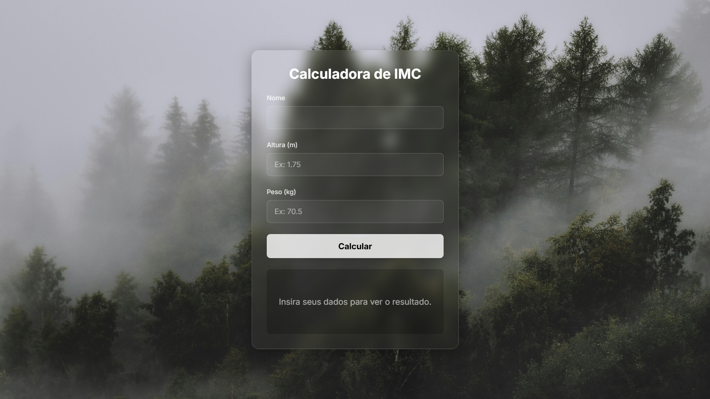
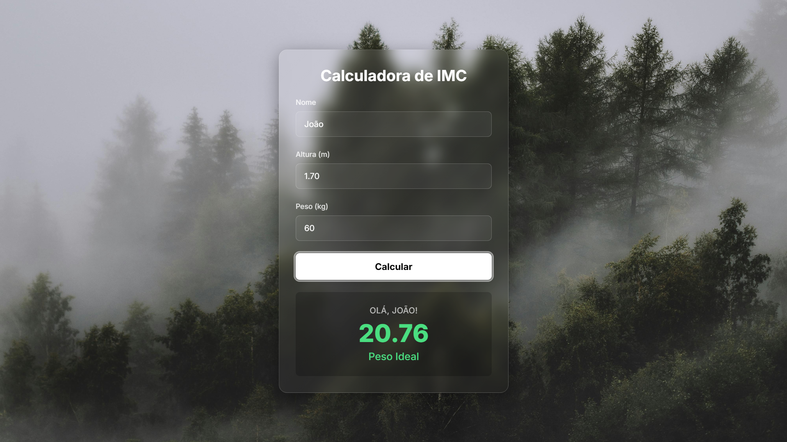

# Calculadora de IMC Moderna

Um projeto simples e elegante de uma Calculadora de Índice de Massa Corporal (IMC). A interface utiliza um design moderno de 'glassmorphism' (efeito de vidro) sobre um fundo dinâmico, e é totalmente responsiva.

O projeto é construído com HTML5, JavaScript puro para a lógica, e estilizado com **Tailwind CSS** para uma rápida prototipação de UI.

## Demonstração

A interface é limpa e intuitiva, com um estado inicial claro e um feedback visual dinâmico após o cálculo.

| Tela Inicial | Tela de Resultado |
| :---: | :---: |
|  |  |

## Funcionalidades

* **Cálculo de IMC:** Calcula o Índice de Massa Corporal com base na altura e peso.
* **Validação de Formulário:** Garante que todos os campos sejam preenchidos com valores válidos (números positivos, altura em metros).
* **Interface Moderna:** Design limpo com efeito *glassmorphism*.
* **Feedback Dinâmico:** Exibe o resultado (Nome, IMC e Classificação) instantaneamente sem recarregar a página.
* **Classificação por Cor:** O resultado é colorido de acordo com a categoria:
    * **Amarelo:** Abaixo do Peso
    * **Verde:** Peso Ideal
    * **Laranja:** Sobrepeso
    * **Vermelho:** Obesidade
* **Tratamento de Erros:** Exibe mensagens de erro claras caso o usuário insira dados inválidos (ex: altura de 3 metros ou campos vazios).
* **Aceita Vírgula e Ponto:** Permite que o usuário insira números decimais com `,` ou `.`.

## Tecnologias Utilizadas

* **HTML5 Semântico**
* **CSS3**
    * **Tailwind CSS** (via CDN)
    * Estilos customizados para o efeito *glassmorphism* e fundo
* **JavaScript (ES6+)** (DOM Manipulation e validação)

## Como Usar

Este é um projeto *front-end* estático. Não é necessário nenhum *build* ou instalação de dependências.

1.  Clone o repositório:
    ```bash
    git clone [https://github.com/seu-usuario/nome-do-repositorio.git](https://github.com/seu-usuario/nome-do-repositorio.git)
    ```
2.  Navegue até a pasta do projeto:
    ```bash
    cd nome-do-repositorio
    ```
3.  Abra o arquivo `index.html` no seu navegador de preferência.

E pronto! A calculadora estará funcionando.
